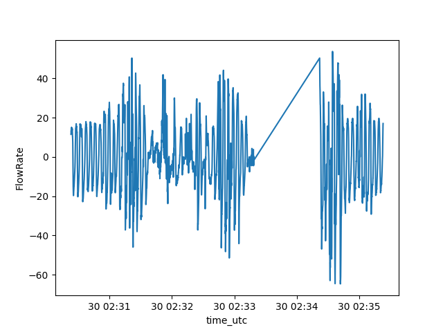

Tutorial
========

PyApnea is able to read .001 files from Oscar Data structure. In this tutorial, we'll see how to read a file from this structure and how to transform it to a dataframe. We'll also see how to use a specialized PyTorch Dataset to read Oscar files.

Loading a .001 file into a dataframe
-------------------------------

Assuming you have a file named '61f5f33c.001'. This file can be found in the `test/` directory of PyApnea source code.

    from pyapnea.oscar.oscar_loader import load_session
    from pyapnea.oscar.oscar_getter import event_data_to_dataframe
    from pyapnea.oscar.oscar_constants import ChannelID

    # this will read the file and transform it to an internal data structure (see data_structure.py)
    oscar_session_data = load_session('61f5f33c.001')

    # this line takes an internal data structure and transform it into a pandas dataframe
    df = event_data_to_dataframe(oscar_session_data=oscar_session_data,
                                 channel_ids=[ChannelID.CPAP_FlowRate.value])

    print(df)

The result should be the following :

                                   time_utc   FlowRate
    0             2022-01-30 02:09:19+00:00  39.960002
    1      2022-01-30 02:09:19.040000+00:00  38.640002
    2      2022-01-30 02:09:19.080000+00:00  38.160002
    3      2022-01-30 02:09:19.120000+00:00  36.840001
    4      2022-01-30 02:09:19.160000+00:00  34.200001
    ...                                 ...        ...
    361495 2022-01-30 06:35:21.800000+00:00  18.720001
    361496 2022-01-30 06:35:21.840000+00:00  18.600001
    361497 2022-01-30 06:35:21.880000+00:00  18.000001
    361498 2022-01-30 06:35:21.920000+00:00  17.160001
    361499 2022-01-30 06:35:21.960000+00:00  15.600001
    
    [397500 rows x 2 columns]
             
Note that the column `time_utc`, as its name suggests, is the UTC time of the points. You can load multiple channels into the dataframe. 

    df = event_data_to_dataframe(oscar_session_data=oscar_session_data,
                                 channel_ids=[ChannelID.CPAP_FlowRate.value,
                                              ChannelID.CPAP_Obstructive.value,
                                              ChannelID.CPAP_ClearAirway.value])
    print(df)

And the result :

                                   time_utc   FlowRate  Obstructive  ClearAirway
    0             2022-01-30 02:09:19+00:00  39.960002          NaN          NaN
    1      2022-01-30 02:09:19.040000+00:00  38.640002          NaN          NaN
    2      2022-01-30 02:09:19.080000+00:00  38.160002          NaN          NaN
    3      2022-01-30 02:09:19.120000+00:00  36.840001          NaN          NaN
    4      2022-01-30 02:09:19.160000+00:00  34.200001          NaN          NaN
    ...                                 ...        ...          ...          ...
    397496 2022-01-30 06:35:21.840000+00:00  18.600001          NaN          NaN
    397497 2022-01-30 06:35:21.880000+00:00  18.000001          NaN          NaN
    397498 2022-01-30 06:35:21.920000+00:00  17.160001          NaN          NaN
    397499 2022-01-30 06:35:21.960000+00:00  15.600001          NaN          NaN
    397500        2022-01-30 02:33:23+00:00        NaN          NaN         10.0

    [397500 rows x 3 columns]

Some remarks can be made from this result. First, the channel `CPAP_Obstructive` is present in the file but does not have any value. Secondly, the `CPAP_ClearAirway` contains values, but they are not in a logical order. Ths dataframe needs to have a sorted index :

    df.set_index('time_utc', inplace=True)
    df.sort_index(inplace=True)
    print(df)

With the result :

                                       FlowRate  Obstructive  ClearAirway
    time_utc                                                             
    2022-01-30 02:09:19+00:00         39.960002          NaN          NaN
    2022-01-30 02:09:19.040000+00:00  38.640002          NaN          NaN
    2022-01-30 02:09:19.080000+00:00  38.160002          NaN          NaN
    2022-01-30 02:09:19.120000+00:00  36.840001          NaN          NaN
    2022-01-30 02:09:19.160000+00:00  34.200001          NaN          NaN
    ...                                     ...          ...          ...
    2022-01-30 06:35:21.800000+00:00  18.720001          NaN          NaN
    2022-01-30 06:35:21.840000+00:00  18.600001          NaN          NaN
    2022-01-30 06:35:21.880000+00:00  18.000001          NaN          NaN
    2022-01-30 06:35:21.920000+00:00  17.160001          NaN          NaN
    2022-01-30 06:35:21.960000+00:00  15.600001          NaN          NaN

You can find value of the `CPAP_ClearAirway` by searching into the dataframe :

    print(df[df.ClearAirway.notnull()])

And the result (some ClearAirway, this night !):

                              FlowRate  Obstructive  ClearAirway
    time_utc                                                     
    2022-01-30 02:33:23+00:00       NaN          NaN         10.0
    2022-01-30 03:06:37+00:00      0.48          NaN         16.0
    2022-01-30 03:25:50+00:00      1.20          NaN         11.0
    2022-01-30 03:28:10+00:00      9.36          NaN         12.0
    2022-01-30 04:49:34+00:00    -10.08          NaN         15.0
    2022-01-30 05:02:07+00:00      3.36          NaN         21.0
    2022-01-30 05:16:17+00:00      4.44          NaN         14.0
    2022-01-30 06:21:43+00:00     -0.96          NaN         15.0
    2022-01-30 06:31:29+00:00      1.92          NaN         13.0

You can see a kind of strange data here. At 2022-01-30 02:33:23+00:00, there is a ClearAirway event without FlowRate. The following code shows the missing values : 

    df = df[(df.index <= '2022-01-30 02:35:23+00:00') & (df.index >= '2022-01-30 02:30:23+00:00')]
    sns.lineplot(df['FlowRate'])
    plt.show()

This code shows :

I do not know what exactly happened at this time. It is not a deliberate stopping machine because this should have been created a new session (thus, a new file). But it seems that this kind of error can happen. That is why `event_data_to_dataframe()` has `mis_value_strategy ` parameter to deal with missing values. There are two possibilities at the moment : a `NaN` in a column can be `ignore`, i.e., the rows are not included in the result dataframe, or the `NaN` value can be replaced by a constant float (put any float value in the parameter dictionary). Here is an example of ignoring rows where `CPAP_FlowRate` is `NaN`. 

    df = event_data_to_dataframe(oscar_session_data=oscar_session_data,
                                 channel_ids=[ChannelID.CPAP_FlowRate.value,
                                              ChannelID.CPAP_Obstructive.value,
                                              ChannelID.CPAP_ClearAirway.value],
                                 mis_value_strategy={ChannelID.CPAP_FlowRate.value: 'ignore'})
    print(df[df.ClearAirway.notnull()])

And the result : 

                            time_utc  FlowRate  Obstructive  ClearAirway
    84376  2022-01-30 03:06:37+00:00      0.48          NaN         16.0
    113201 2022-01-30 03:25:50+00:00      1.20          NaN         11.0
    116701 2022-01-30 03:28:10+00:00      9.36          NaN         12.0
    238801 2022-01-30 04:49:34+00:00    -10.08          NaN         15.0
    257626 2022-01-30 05:02:07+00:00      3.36          NaN         21.0
    278876 2022-01-30 05:16:17+00:00      4.44          NaN         14.0
    377026 2022-01-30 06:21:43+00:00     -0.96          NaN         15.0
    391676 2022-01-30 06:31:29+00:00      1.92          NaN         13.0

Do not forget that the result of `event_data_to_dataframe()` is a pandas dataframe, so any dataframe
operation is accessible to organize data.

RawOscarDataset
---------------

If you are using the library `Torch`, the `RawOscarDataset` runs all these previous loading tasks for you. This class respect the simple interface of a Torch Dataset but load files only at will when the program access it. This could inscrease the time of treatment but limits the memory used.

Using a `RawOscarDataset` is simple:

    dataset = RawOscarDataset(data_path='test/data/raw')
    print(dataset[0])  # accessing the first element

and it produces, by default, two numpy arrays. The first one is the `FlowRate` and the second one represents the Apnea events:

    (array([[39.96000159],
           [38.64000154],
           [38.16000152],
           ...,
           [18.00000072],
           [17.16000068],
           [15.60000062]]), array([[0.],
           [0.],
           [0.],
           ...,
           [0.],
           [0.],
           [0.]]))

The elements are ordered according the name of the files : `dataset[0]` contains data from the first file, `dataset[1]`, from the second one and so on.

The `RawOscarDataset` class provides multiple parameters to control the output of the element. The first one is `getitem_type`. This parameter can force the class to output the element as numpy arrays (by default) or as a dataframe. 

    dataset = RawOscarDataset(data_path='test/data/raw', getitem_type='dataframe')
    print(dataset[0])  # accessing the first element as dataframe

with the following result:

                                       FlowRate  Obstructive  ...  Apnea  ApneaEvent
    time_utc                                                  ...                   
    2022-01-30 02:09:19+00:00         39.960002          NaN  ...    NaN         0.0
    2022-01-30 02:09:19.040000+00:00  38.640002          NaN  ...    NaN         0.0
    2022-01-30 02:09:19.080000+00:00  38.160002          NaN  ...    NaN         0.0
    2022-01-30 02:09:19.120000+00:00  36.840001          NaN  ...    NaN         0.0
    2022-01-30 02:09:19.160000+00:00  34.200001          NaN  ...    NaN         0.0
    ...                                     ...          ...  ...    ...         ...
    2022-01-30 06:35:21.800000+00:00  18.720001          NaN  ...    NaN         0.0
    2022-01-30 06:35:21.840000+00:00  18.600001          NaN  ...    NaN         0.0
    2022-01-30 06:35:21.880000+00:00  18.000001          NaN  ...    NaN         0.0
    2022-01-30 06:35:21.920000+00:00  17.160001          NaN  ...    NaN         0.0
    2022-01-30 06:35:21.960000+00:00  15.600001          NaN  ...    NaN         0.0

    [397500 rows x 6 columns]

The `channel_ids` parameter allows the user to add some channel to get in place of `CPAP_FlowRate`. Note that all Events channels will be getting even if they are not specified in this parameter (see below). Moreover, this will work only with a dataframe. The numpy output produces, at the moment, only the output of the `FlowRate`. It will cause an exception if this channel is not given.

    dataset = RawOscarDataset(data_path='test/data/raw',
                              getitem_type='dataframe',
                              channel_ids=[ChannelID.CPAP_Leak.value,
                                           ChannelID.CPAP_FlowRate.value])
    print(dataset[0])  # accessing the first element with CPAP_Leak and CPAP_FlowRate

With the following result:

                                      Leak   FlowRate  ...  Apnea  ApneaEvent
    time_utc                                           ...                   
    2022-01-30 02:09:19+00:00          NaN  39.960002  ...    NaN         0.0
    2022-01-30 02:09:19.040000+00:00   NaN  38.640002  ...    NaN         0.0
    2022-01-30 02:09:19.080000+00:00   NaN  38.160002  ...    NaN         0.0
    2022-01-30 02:09:19.120000+00:00   NaN  36.840001  ...    NaN         0.0
    2022-01-30 02:09:19.160000+00:00   NaN  34.200001  ...    NaN         0.0
    ...                                ...        ...  ...    ...         ...
    2022-01-30 06:35:21.800000+00:00   NaN  18.720001  ...    NaN         0.0
    2022-01-30 06:35:21.840000+00:00   NaN  18.600001  ...    NaN         0.0
    2022-01-30 06:35:21.880000+00:00   NaN  18.000001  ...    NaN         0.0
    2022-01-30 06:35:21.920000+00:00   NaN  17.160001  ...    NaN         0.0
    2022-01-30 06:35:21.960000+00:00   NaN  15.600001  ...    NaN         0.0
    
    [397683 rows x 7 columns]

The parameter `output_events_merged` precise what kind of Events are merged into the ApneaEvent column (or the second array for the `numpy` output). 

With all events included in the `ApneaEvent` column: 

    print(dataset[0][dataset[0].ApneaEvent != 0.0])

gives the result:

                                      Leak  FlowRate  ...  Apnea  ApneaEvent
    time_utc                                          ...                   
    2022-01-30 03:06:27+00:00          NaN      1.56  ...    NaN         1.0
    2022-01-30 03:06:27.040000+00:00   NaN      3.96  ...    NaN         1.0
    2022-01-30 03:06:27.080000+00:00   NaN      4.68  ...    NaN         1.0
    2022-01-30 03:06:27.120000+00:00   NaN      3.72  ...    NaN         1.0
    2022-01-30 03:06:27.160000+00:00   NaN      1.56  ...    NaN         1.0
    ...                                ...       ...  ...    ...         ...
    2022-01-30 06:31:28.840000+00:00   NaN      1.92  ...    NaN         1.0
    2022-01-30 06:31:28.880000+00:00   NaN      4.68  ...    NaN         1.0
    2022-01-30 06:31:28.920000+00:00   NaN      4.80  ...    NaN         1.0
    2022-01-30 06:31:28.960000+00:00   NaN      3.12  ...    NaN         1.0
    2022-01-30 06:31:29+00:00          NaN      1.92  ...    NaN         1.0
    
    [2008 rows x 7 columns]

You can note that are more events than when we loaded the file with `event_data_to_dataframe()`. Indeed, the `RawOscarDataset` completes the ApneaEvent with the medical definition of an apnea event. Since the events are marked at the end of the event, an internal function `generate_annotations()` marks all points 10 seconds before each event. Note that only the `ApneaEvent` column is completed. All other event columns are kept like the original data. At the moment, no parameter exists to change the behaviour of the annotation.

With only ApneaEvent representing `Obstructive`, using the parameter `output_events_merged`:

    dataset = RawOscarDataset(data_path='test/data/raw',
                              getitem_type='dataframe',
                              channel_ids=[ChannelID.CPAP_Leak.value,
                                           ChannelID.CPAP_FlowRate.value],
                              output_events_merged=[ChannelID.CPAP_Obstructive.value])
    print(dataset[0][dataset[0].ApneaEvent != 0.0])

gives the following result :

    Empty DataFrame
    Columns: [Leak, FlowRate, Obstructive, Hypopnea, ClearAirway, Apnea, ApneaEvent]
    Index: []

No Obstructive event this night ! 

At last, we can see the number of elements in the dataset :

    print(len(dataset))

gives 

    2